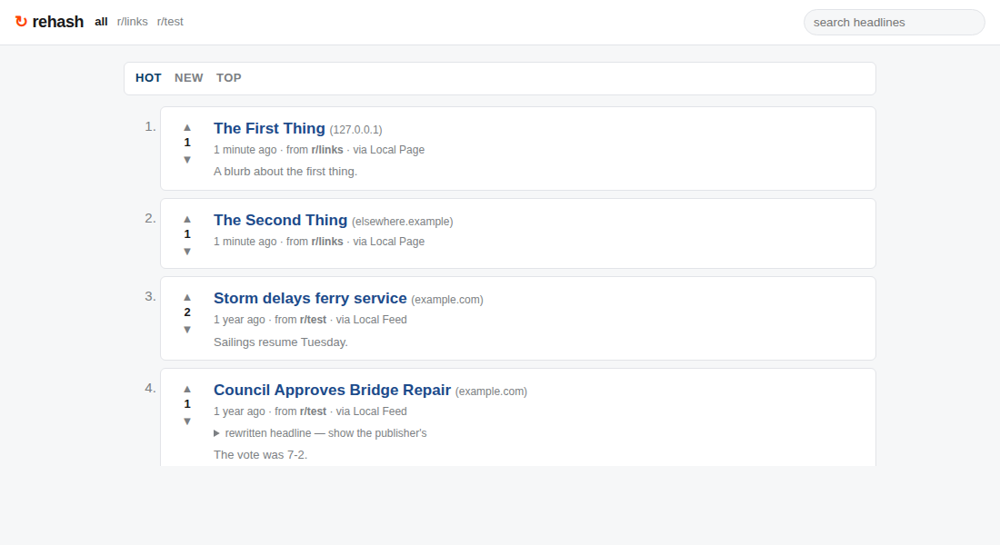

# rehash

A Sinatra app that crawls sites, rewrites the headlines it finds, and shows the
links reddit-style: ranked by score against age, split into communities, with
vote arrows on the left.

Nothing about it is news-specific. A source is any page that lists links —
an RSS/Atom feed or an HTML page you hand a couple of CSS selectors.



## Quick start

```bash
bundle install
bin/crawl                 # fetch + rewrite; takes a minute on a cold start
bundle exec rackup        # http://localhost:9292
```

`bin/crawl` writes to `db/rehash.development.sqlite3`. Re-run it whenever you
want fresh links — it never duplicates a URL it has already stored.

## Sources

Sources live in [`config/sources.yml`](config/sources.yml). Each one belongs to
a community, which becomes an `/r/<name>` section:

```yaml
sources:
  - key: hackernews          # unique id, used by `bin/crawl --only`
    name: Hacker News        # shown as "via Hacker News"
    community: tech          # /r/tech
    type: feed               # RSS or Atom — only `url` is needed
    url: https://hnrss.org/frontpage

  - key: github-trending
    name: GitHub Trending
    community: code
    type: html               # scrape a plain page instead
    url: https://github.com/trending
    selectors:
      item: "article.Box-row"   # one match per link
      title: "h2 a"             # inside the row; omit to use the row's text
      link: "h2 a"              # inside the row; omit to use its href
      summary: "p"              # optional
```

Relative links are resolved against the page, duplicate URLs are dropped, and
`max_items` caps how much each source contributes per crawl.

## Rewriting headlines

Rewriting is pluggable — pick one with `REWRITER`:

| `REWRITER` | What it does |
| --- | --- |
| `rule_based` (default) | Offline and deterministic. Strips section labels (`BREAKING:`), the trailing outlet name (`— Reuters`), all-caps shouting, teaser clauses (`, and here's why`) and stray punctuation, then trims to headline length. |
| `claude` | Genuine rewrites through the Anthropic API. Needs `ANTHROPIC_API_KEY`. |
| `none` | Keeps the publisher's headline verbatim. |

```bash
REWRITER=claude ANTHROPIC_API_KEY=sk-ant-... bin/crawl
```

The Claude rewriter sends a whole page of headlines in one request, asks for
plain, accurate rewrites under structured outputs, and falls back to the
rule-based rewriter on any error — a missing key or a rate limit slows a crawl
down, it never breaks one. `ANTHROPIC_MODEL` (default `claude-opus-5`),
`REWRITE_BATCH_SIZE` and `REWRITE_STYLE` (a line of house style, e.g.
`"Be dry and literal"`) tune it.

Every link keeps its original headline, one click away under the title. The
rewrite is an editorial layer, not a replacement for the record.

## Ranking

`hot` is reddit's ordering: `log10(|score|) + age / 45000`, so a link needs an
order of magnitude more votes to hold its place against every ~12 hours of age.
`new` sorts by publication time and `top` by raw score. Votes are anonymous and
tied to a cookie; voting the same way twice takes the vote back.

`Rehash::Ranking.confidence` (the Wilson lower bound reddit uses for "best") is
there too if you want to sort on it.

## Command line

```bash
bin/crawl                       # every source
bin/crawl --only tech,lobsters  # by community or by source key
bin/crawl --rewriter none       # override REWRITER for one run
bin/crawl --list                # show the configured sources
bin/crawl --prune 30            # delete links older than 30 days
bin/crawl --rescore             # recompute ranking after changing the constants
```

Run it from cron for a live site:

```cron
*/20 * * * * cd /srv/rehash && REWRITER=claude bin/crawl --quiet
```

Or set `CRAWL_INTERVAL=1200` to have the web process crawl in a background
thread instead — fine for one box, not for several.

## Configuration

| Variable | Default | Meaning |
| --- | --- | --- |
| `REWRITER` | `rule_based` | Which rewriter to use |
| `ANTHROPIC_API_KEY` | — | Required by the `claude` rewriter |
| `ANTHROPIC_MODEL` | `claude-opus-5` | Model for the `claude` rewriter |
| `REWRITE_BATCH_SIZE` | `12` | Headlines per API request |
| `REWRITE_STYLE` | — | Extra house-style line for the prompt |
| `DATABASE_PATH` | `db/rehash.<env>.sqlite3` | SQLite file |
| `SOURCES_FILE` | `config/sources.yml` | Source list |
| `CRAWL_INTERVAL` | `0` | Seconds between background crawls; `0` disables |
| `USER_AGENT` | `RehashBot/0.1 …` | How the crawler identifies itself |

## Routes

| Route | |
| --- | --- |
| `GET /` | Front page — `?sort=hot\|new\|top`, `?q=`, `?page=` |
| `GET /r/:community` | One community, same parameters |
| `POST /posts/:id/vote` | Vote (`value=1\|-1`); JSON for fetch, redirect without JS |
| `GET /feed.xml`, `GET /r/:community/feed.xml` | The rewritten headlines, as RSS |
| `GET /about` | What this is, and the live source list |
| `GET /healthz` | `{"status":"ok", …}` |

## Layout

```
app: config.ru → lib/rehash/web.rb (Sinatra) → views/ + public/
lib/rehash/
  config.rb       sources.yml + environment knobs
  fetcher.rb      polite HTTP: user agent, robots.txt, per-host delay, redirects
  crawler.rb      feeds and HTML → items → rewriter → storage
  rewriter.rb     registry; rewriters/rule_based.rb, rewriters/claude.rb
  repository.rb   all the SQL
  ranking.rb      hot + confidence
  database.rb     SQLite schema and connection
bin/crawl         CLI
test/             minitest; no network, no API calls
```

## Tests

```bash
bundle exec rake test
```

57 tests covering ranking, the rule-based rules, feed and HTML extraction,
storage and voting, the Claude rewriter (against a stubbed client) and every
route. Nothing in the suite touches the network.

## Crawling politely

The crawler identifies itself, honours `robots.txt`, waits between requests to
the same host, caps response size, stores only headline-length excerpts, and
always links to the publisher. Keep it that way — and check a site's terms
before pointing this at it, especially with rewriting turned on.
